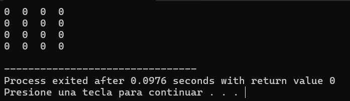

# Práctica de Laboratorio: Manejo de Matrices en C

## Objetivo
Aprender y dominar el manejo de **matrices (arreglos bidimensionales)** en lenguaje **C**, incluyendo su **declaración, inicialización, recorrido y operaciones básicas y avanzadas**.

## Conocimientos Previos
Antes de comenzar, asegúrate de tener claro lo siguiente:
- Variables y tipos de datos en C  
- Estructuras de control (if, for, while)  
- Arreglos unidimensionales  
- Funciones básicas  

## Ejercicios Realizados

## Ejercicio 1: Declaración e Inicialización
- Declarar una matriz de 4x4 
- Inicializar todos los elementos en 0 usando ciclos anidados  
- Imprimir la matriz en formato de tabla  

## Ejercicio 2: Llenar Matriz Manualmente
- Solicitar al usuario los 16 valores de la matriz  
- Guardar cada valor en su posición  
- Imprimir la matriz completa  

## Ejercicio 3: Matriz con Valores Aleatorios
- Llenar la matriz 4x4 con números aleatorios del 0 al 9  
- Contar y mostrar la cantidad de números pares e impares  

## Ejercicio 4: Suma de Elementos
- Generar matriz aleatoria  
- Calcular la suma y el promedio de todos los elementos  

## Ejercicio 5: Máximo y Mínimo
- Encontrar el valor máximo y mínimo con sus posiciones (fila, columna)  

## Ejercicio 6: Suma por Filas y Columnas
- Calcular y mostrar la suma de cada fila y columna  

## Ejercicio 7: Suma de Matrices
- Crear dos matrices A y B
- Sumar ambas en una nueva matriz C = A + B
- Mostrar las tres matrices  

## Ejercicio 8: Resta de Matrices
- Realizar la operación C = A - B y mostrar el resultado  

## Ejercicio 9: Multiplicación de Matrices
- Implementar la multiplicación de matrices según las reglas del álgebra lineal  
- Verificar compatibilidad de dimensiones  

## Ejercicio 10: Matriz Transpuesta
- Generar una matriz A (3x4) y calcular su transpuesta (4x3)  

## Ejercicio 11: Diagonal Principal y Secundaria
- Mostrar los elementos de ambas diagonales  
- Calcular la suma de cada una  

## Ejercicio 12: Buscar Elemento
- Generar una matriz 4x4 
- Permitir al usuario buscar un valor  
- Indicar si existe y en qué posiciones aparece  

## Archivos Incluidos
- `ejercicio1.c` → Declaración e inicialización  https://github.com/Sword2711-ite/Estructuras-Matrices/blob/main/ejercicio-1.cpp
- `ejercicio2.c` → Llenado manual                https://github.com/Sword2711-ite/Estructuras-Matrices/blob/main/ejercicio-2.cpp 
- `ejercicio3.c` → Valores aleatorios            https://github.com/Sword2711-ite/Estructuras-Matrices/blob/main/ejercicio-3.cpp  
- `ejercicio4.c` → Suma y promedio               https://github.com/Sword2711-ite/Estructuras-Matrices/blob/main/ejercicio-4.cpp
- `ejercicio5.c` → Máximo y mínimo               https://github.com/Sword2711-ite/Estructuras-Matrices/blob/main/ejercicio-5.cpp
- `ejercicio6.c` → Suma por filas y columnas     https://github.com/Sword2711-ite/Estructuras-Matrices/blob/main/ejercicio-6.cpp
- `ejercicio7.c` → Suma de matrices              https://github.com/Sword2711-ite/Estructuras-Matrices/blob/main/ejercicio-7.cpp  
- `ejercicio8.c` → Resta de matrices             https://github.com/Sword2711-ite/Estructuras-Matrices/blob/main/ejercicio-8.cpp
- `ejercicio9.c` → Multiplicación                https://github.com/Sword2711-ite/Estructuras-Matrices/blob/main/ejercicio9.cpp 
- `ejercicio10.c` → Transpuesta                  https://github.com/Sword2711-ite/Estructuras-Matrices/blob/main/ejercicio10.cpp
- `ejercicio11.c` → Diagonales                   https://github.com/Sword2711-ite/Estructuras-Matrices/blob/main/ejercicio-11.cpp
- `ejercicio12.c` → Buscar elemento              https://github.com/Sword2711-ite/Estructuras-Matrices/blob/main/ejercicio-12.cpp
- `README.md` (este archivo)

## Rúbrica de Evaluación  
https://github.com/pakoite/ite/blob/main/Rubrica_Evaluacion_C.md

## Autor
**Jean Carlo López Torres**  
Práctica: Manejo de Matrices
Instituto Tecnológico de Ensenada
